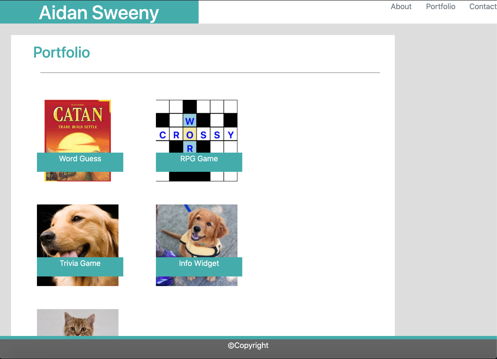

# responsive-portfolio

For this assigment we were assigned to create a website that would contain three pages. A  portfolio page, a contact page, and an about page. We were provided templates that showed how this was all supposed to be laid out, and how it was supposed to scale when the window was changed. 

To create this project I started by creating three files, one for each of the pages of the site. The contact page contained a form, which was a template from the bootstrap website. I was able to format this form, as well as the navbar and footer using the bootstrap content, as well as some CSS styling. Using rows and columns for the navbar, I was able to scale my name, and the other links, so that they would stack nicely once the window was collapsed. This can be seen through the class tag below:
```
col-md-2 tabs col-sm-4 text-md-right text-sm-center
```
Creating the footer, I was able to fix it to the bottom of the page so that it would act as a footer. 

I also created a row and column for the form, so that it would only span half of the page. This file resulted in the following images shown below:


The next page was the about/ index.html file. This was created using the same nav bar and footer that was used in the last page. To create this text box, I used the image-wrapper class for the image, and the single-post-content-wrapper class for the text. This allowed the text to start to the right of the image and wrap around and below it. The resulting screens are as follows below: 


The last page was the profile page. I again used the footer and navbar from the past two pages. To create the images for the portfolio page I made a container to hold all of them. I then used rows and columns so that I could format them the way I needed. I used a margin of 4 all the way around for the images, and had to format the text using CSS to make it fit correctly. I also used some media query to ensure that when the page was made smaller, it would follow the pattern I wanted. I used a medium col of 4 and a small col 8. This allowed the images to take up more space when the window was smaller. The resulting page looked as follows:




Lastly I created links from the tabs in the top right corner to the other pages. 
## Getting Started

To get this project running, one must copy the files from the class repository.

### Prerequisites

To have this project run, one must download VS Code off the appstore, and create a GitHub account. Git is also required to run this program, which can be downloaded 

```
$ brew install git. 
```
Homebrew can also be downloaded by inputting the following command in the terminal:
```
/bin/bash -c "$(curl -fsSL https://raw.githubusercontent.com/Homebrew/install/master/install.sh)"
```

### Installing

To install this project one must go through the GitHub website in order to clone this project. Clicking on the cone or download button and then copying the link that comes from that. One can then go into the Terminal application, and use the following command to copy the files:
`
git clone URL
`
This should then be moved to your desktop, or somewhere else on your computer. This will allow access to the html and css files. Opening the html file in a default browser will allow one to observe the website.

## Built With

* [HTML](https://developer.mozilla.org/en-US/docs/Web/HTML)
* [CSS](https://developer.mozilla.org/en-US/docs/Web/CSS)

## Deployed Link

* [See Live Site](https://aidansweeny.github.io/responsive-portfolio/)

## Authors

* Aidan Sweeny

- [Link to Github](https://github.com/AidanSweeny)
- [Link to LinkedIn](https://www.linkedin.com/in/aidan-sweeny-81075030/)

## License

This project is licensed under the MIT License 

## Acknowledgments

* Berkley Coding Bootcamp

